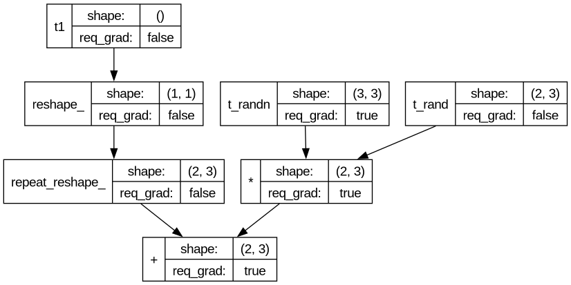
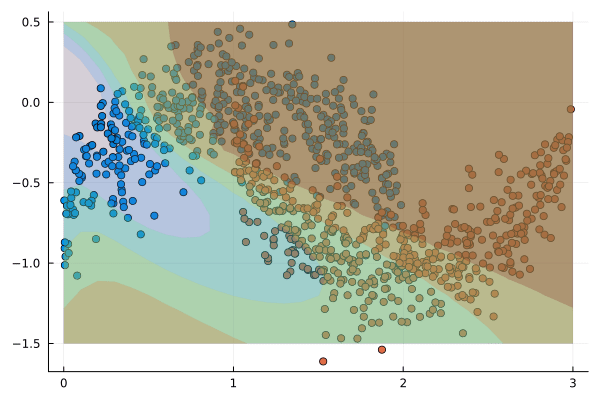

# Backprop.jl
*A tiny autogradient library in Julia.* 
(under construction :construction:)


## Introducing autodiff engine: Jacobi
`Backprop.Jacobi` is a simple and lightweight automatic differentiation engine that is able to compute gradients of scalar-valued and vector-valued functions via reverse mode differentiation (aka backpropagation).

```julia
import Backprop
import Backprop: Jacobi
import Backprop.Jacobi: Tensor as Tensor

x = jcb.Tensor([1., 2., 3.]) # A wrapping interface for Julia's vectors
W = jcb.Tensor([2. 0. 0.;
                0. 1. 0.;
                0. 0. 2.], requires_grad=true) # and matrices!
f = tanh(W * x) # Tensors work with almost all Julia's math functions

jcb.backward!(f) # Starts autodiff task

# Only comoute and save the gradients when it is required:
W.grad
# W.grad = Backprop.Jacobi.Tensor
# data
# 3×3 Matrix{Float64}:
#   0.0706508   0.141302    0.211952
#   0.0706508   0.141302    0.211952
#   2.45765e-5  4.91531e-5  7.37296e-5

x.grad # = nothing
```

You only need to declare all mathematical operations applied to `Jacobi.Tensor` and you will get the required gradients (those who you specified using `requires_grad=true`) after call the function `Jacobi.backward!`.

In addition to constructing tensors from matrices, `Jacobi` supports common constructors for tensors present in libraries like NumPy and PyTorch.

```julia
a = jcb.randn((2, 2))
# Backprop.Jacobi.Tensor
# 2×2 Matrix{Float64}:
#    -0.282192  -0.39531
#    0.818184   1.08304

# Backprop.Jacobi.Tensor
#   [1.0, 1.0, 1.0]
b = jcb.ones(3)

# Backprop.Jacobi.Tensor
#   [π, π, π]
c = jcb.fill_like(π, b)

size(b) == size(c) # true
```

Basic memory operations and indexing is supported, and we hope to extend the library with advanced memory operations and allocation!

```julia
x = jcb.arange(8)
# Backprop.Jacobi.Tensor
#   [0.0, 1.0, 2.0, 3.0, 4.0, 5.0, 6.0, 7.0, 8.0]

x = reshape(x, (3, 3))
# Backprop.Jacobi.Tensor
# 3×3 Matrix{Float64}:
#    0.0  3.0  6.0
#    1.0  4.0  7.0
#    2.0  5.0  8.0

slice = x[:, 2]
# Backprop.Jacobi.Tensor
#   [3.0, 4.0, 5.0]

repeated = repeat(slice, (2, 3))
# Backprop.Jacobi.Tensor
# 6×3 Matrix{Float64}:
#    3.0  3.0  3.0
#    4.0  4.0  4.0
#    5.0  5.0  5.0
#    3.0  3.0  3.0
#    4.0  4.0  4.0
#    5.0  5.0  5.0
```

And we have a full support for vectorized operations!

```julia
X = jcb.eye(3)
b = jcb.Tensor(-1.0)

X .+ b
# Backprop.Jacobi.Tensor
# 3×3 Matrix{Float64}:
#     0.0  -1.0  -1.0
#    -1.0   0.0  -1.0
#    -1.0  -1.0   0.0
```


## Computational graph visualization

`Jacobi` uses Graphviz to render the computational graphs built using tensors. These graphs can be rendered in Pluto.jl notebooks, allowing for quick checks of graph structure and, more important, teaching purposes.

```julia
# declare all tensors involved in a basic artificial neuron
X = jcb.rand((2, 3))
W = jcb.randn((3, 3), requires_grad=true)
b = jcb.Tensor(-1.0)

# make the prediction
p = X * W .+ b

# plot the computational graph
Backprop.plot_tensor(p)
```


## API for neural netwoks
Although `Backprop.jl` was made with the intention of work as a general purpose autodifferentation engine, we provide a simple API to build neural networks with `Backprop.nn`.

```julia
import Backprop.nn as nn
import Backprop.data as data
```

We are trying to extend our API in order to make a complete environment for basic experiments. For this purpose, we create functions similar to whose that are present in Scikit-learn and PyTorch:

```julia
X, y = data.make_moons(1000) # moons dataset with 1000 samples
dataset = data.Dataset(X, y, 64) # create a dataset with batch size of 64
```

At the moment, we only support feed-forward neural networks, but we want to extend our API to support more advanced architectures on GPU!

```julia
model = nn.Sequential(
    nn.Linear(2,  8),
    nn.Tanh(),
    nn.Linear(8, 16),
    nn.Tanh(),
    nn.Linear(16, 8),
    nn.Tanh(),
    nn.Linear(8, 1),
    nn.Sigmoid(),
)
```

The training process of our API is inspired by PyTorch :heart:

```julia
function train(model::nn.Model, dataset::data.Dataset; α::Float64 = 0.1, epochs::Int64 = 200)
  # only for logging purposes
  history = Vector{Float64}()

  # declare the optimizing algorithm
  optimizer = nn.GradientDescent(model.params, lr=α)

  # iterate over all epochs
  for _ in 1:epochs
    epoch_loss = 0.0

    # in each epoch we iterate over all datasets
    for (Xi, yi) in dataset
      pi = model.forward(Xi) # make the predeictions
      loss = nn.bce_loss(pi, yi) # compute our loss

      # save the loss for log it
      epoch_loss += loss.data[1]

      Jacobi.backward!(loss) # compute the gradients!
      nn.step(optimizer) # update the weights
      Jacobi.clear_grads(loss) # clear the gradients
    end
    # save the loss per epoch
    push!(history, epoch_loss / length(dataset))
  end

  return history
end
```
